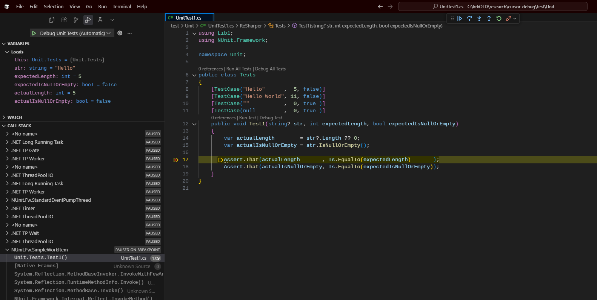

# Cursor AI C# .NET Debugging

An example repository demonstrating how to debug C# .NET 9 NUnit tests in Cursor AI, with proper setup for both automatic and manual debugging scenarios.



## TL;DR

Until the Cursor team fixes their C# extension to allow debugging tests, we can work around the limitation with only the [launch.json](.vscode/launch.json) file.

### Define a Launch Configuration

Use the `coreclr` type and `attach` to a specific Process ID.

To avoid needing to manually find the PID and/or select the process from a list, we can get the PID via an _**input**_.

```json
{
    "name": "Debug Unit Tests (Automatic)",
    "type": "coreclr",
    "request": "attach",
    "processId": "${input:spawnTestsGetPid}",
    "justMyCode": false
}
```

### Define an Input

The input needs to start the test host running, find its PID and return it so the debugger can attach to the test host.

```json
{
    "id": "spawnTestsGetPid",
    "type": "command",
    "command": "shellCommand.execute",
    "args": {
        "useFirstResult": true,
        "command": "pwsh -NoProfile -Command \"$env:VSTEST_HOST_DEBUG='1'; $dotnet = Start-Process dotnet -PassThru -WindowStyle Hidden -ArgumentList 'test','test/Unit/Unit.csproj','--configuration','Debug','--no-build'; $processId = $null; for($i=0; $i -lt 50 -and -not $processId; $i++){ $t = Get-Process -Name testhost -ErrorAction SilentlyContinue; if($t){ $processId = $t.Id; break }; Start-Sleep -Milliseconds 100; }; $processId\""
    }
}
```

Here's the PowerShell command in a more readable format:

```powershell
# Instruct the test host to wait for a debugger to attach
$env:VSTEST_HOST_DEBUG = '1';

# dotnet test test/Unit/Unit.csproj --configuration Debug --no-build
$dotnet = Start-Process dotnet -PassThru -WindowStyle Hidden -ArgumentList 'test', 'test/Unit/Unit.csproj', '--configuration', 'Debug', '--no-build';

# Wait for the test host to start and get its process ID
$processId = $null;

for ($i = 0; $i -lt 50 -and -not $processId; $i++)
{
    $t = Get-Process -Name testhost -ErrorAction SilentlyContinue

    if ($t)
    {
        $processId = $t.Id;
        break
    }

    # retry after a short delay
    Start-Sleep -Milliseconds 100;
}

# return the process ID to be used in the launch configuration
$processId
```

## 📋 Overview

This repository provides working examples and configurations for debugging C# .NET NUnit test projects in Cursor AI.

License restrictions disallow non-Microsoft IDEs/tools from using their C# extensions, so Anysphere (Cursor AI) released their own [C# extension](https://github.com/cursor/cursor) that uses the open source Samsung [netcoredbg](https://github.com/Samsung/netcoredbg) .NET debugger. It's a bit rough around the edges in its current state, and things like `Debug Test` in the CodeLens above an NUnit test method doesn't work - the debugger doesn't attach, the test doesn't run, breakpoint doesn't get hit.

There are a lot of posts and confusion about debugging .NET code in Cursor AI - some of it pre-dating the Anysphere C# extension. I found that their (relatively) new extension allowed me to debug a console application just fine, but not so much with an NUnit test. There are a few other shortcomings, but not being able to debug an NUnit test is a big deal for myself and my team. So, I set out to find a workable solution that didn't require manual interaction, and hopefully learn a few things along the way since my .NET Debugging experience has almost exclusively been in Visual Studio with ReSharper. The [ReSharper extension for VS Code](https://www.jetbrains.com/resharper/vscode/) (and Cursor AI) has actually gotten a lot better, but it doesn't yet support debugging tests, either.

## 🏗️ Project Structure

```
cursor-debug/
├── src/
│   ├── Console1/                 # Main console application
│   │   ├── Program.cs            # Entry point with debugging examples
│   │   └── Console1.csproj
│   └── Lib1/                     # Library project
│       ├── Extensions.string.cs  # Extension methods
│       └── Lib1.csproj
├── test/
│   └── Unit/                     # NUnit test project
│       ├── UnitTest1.cs          # Sample tests
│       └── Unit.csproj
└── .vscode/                      # VSCode/Cursor configuration
    ├── launch.json               # Debug configurations - this is the key for debugging NUnit tests
    ├── settings.json             # C# debugging settings
    └── tasks.json                # Build tasks
```

## 🚀 Quick Start

1. **Clone the repository**
   ```bash
   git clone <repository-url>
   cd cursor-debug
   ```

2. **Build the solution**
   ```bash
   dotnet build
   ```

3. **Open in Cursor** and start debugging!

## 🐛 Debugging Configurations

### NUnit Test Debugging

This repository provides two approaches for debugging NUnit tests:

#### 🔄 Automatic Test Debugging (Recommended)

**Perfect for:** Quick debugging without manual process selection

1. Set a breakpoint in your test method (`test/Unit/UnitTest1.cs`)
2. Go to `Run and Debug` pane
3. Select `Debug Unit Tests (Automatic)`
4. Click the play button
5. The debugger automatically attaches and breaks at your breakpoint

**How it works:** Uses a PowerShell script that automatically starts the test process and finds the `testhost` process ID for attachment.

#### 🔧 Manual Test Debugging

**Perfect for:** When you need more control over the debugging process

1. **Start the test process:**
   ```powershell
   $env:VSTEST_HOST_DEBUG="1"; dotnet test test/Unit/Unit.csproj --configuration Debug --no-build
   ```

2. **Set breakpoints** in your test methods

3. **Attach debugger:**
   - Go to `Run and Debug` pane
   - Select `Debug Unit Tests (Manual)`
   - Choose the `testhost.exe` process from the list

4. **Continue execution** - the debugger will break at your breakpoints

### Console Application Debugging

1. Open `src/Console1/Program.cs`
2. Set a breakpoint on any line
3. Press `F5` or go to `Run and Debug` → `.NET Core Launch (console)`
4. The debugger will stop at your breakpoint

## ⚙️ Configuration Details

### Launch Configuration (`.vscode/launch.json`)

The repository includes three debug configurations:

- **`Debug Unit Tests (Automatic)`** - Automated test debugging with PowerShell
- **`Debug Unit Tests (Manual)`** - Manual process attachment for tests
- **`.NET Core Launch (console)`** - Standard console app debugging

### Key Settings (`.vscode/settings.json`)

Optimized C# debugging settings including:
- `justMyCode: false` - Debug into framework code
- `suppressJITOptimizations: true` - Better debugging experience
- Symbol server configuration for Microsoft and NuGet symbols
- Enhanced logging for troubleshooting

## 🧪 Sample Code

### Extension Method Example

```csharp
public static bool IsNullOrEmpty(this string? @this)
{
    return string.IsNullOrEmpty(@this);
}
```

### Test Cases

```csharp
[TestCase("Hello"      ,  5, false)]
[TestCase("Hello World", 11, false)]
[TestCase(""           ,  0, true )]
[TestCase(null         ,  0, true )]
public void Test1(string? str, int expectedLength, bool expectedIsNullOrEmpty)
{
    var actualLength        = str?.Length ?? 0;
    var actualIsNullOrEmpty = str.IsNullOrEmpty();

    Assert.That(actualLength       , Is.EqualTo(expectedLength)       );
    Assert.That(actualIsNullOrEmpty, Is.EqualTo(expectedIsNullOrEmpty));
}
```

## 🛠️ Requirements

- **.NET 9.0** or later (earlier versions will likely as well, but I am using .NET 9)
- **Cursor AI** (I have the Anysphere C# extension and the ReSharper extension)
- **PowerShell 7** (for automatic test debugging)

## 🤝 Contributing

This repository is designed to help the Cursor AI community with debugging configurations. If you have improvements or additional debugging scenarios, contributions are welcome!

## 📝 License

MIT

## 🙏 Acknowledgments

Created to address common debugging questions in the Cursor AI community forums, particularly around NUnit test debugging which is not well-documented.
